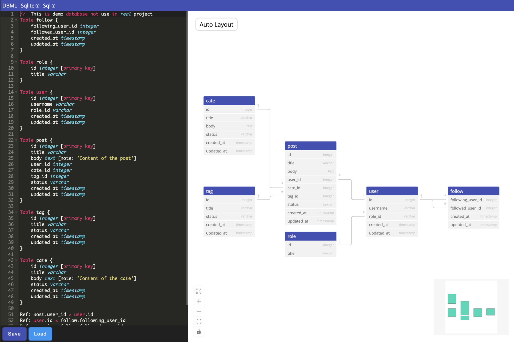

# DBML VueJS Vue-Flow
This repo is a part of project that use ERD-DBML to auto generate model, api for mikro-orm, expressjs



A simplified and open-source alternative to **dbdiagram.io**, offering powerful features for database modeling:

- **DBML Editing and Saving**: Easily edit and save your database schema.
- **DBML Rendering**: Visualize schemas with Vue Flow integration.
- **Auto-layout**: Generate layouts automatically using Dagre with LR indexing.

---

## Todo
- Publish vue-dbml component package
- Download: DBML, sqlite, sql

---

## Tools
- ⚡ **Fast Development**: Built with [Vite](https://vitejs.dev/) for blazing-fast builds and optimized production workflows.
- 🛠️ **Component-Based Architecture**: Modular and reusable Vue components ensure
- 🚀 **State Management**: Seamless state handling using [Pinia](https://pinia.vuejs.org/).
- 📦 **Modern Tooling**: Includes ESLint and Prettier to maintain clean, consistent, and error-free code.

---

## Installation

1. **Clone the Repository**
   Run the following commands to clone and set up the project:
   ```bash
   git clone https://github.com/rxzcode/vue-dbml.git
   cd vue-dbml
   yarn
   ```

2. **Dev, Build and Preview Commands**:
   - `yarn dev` for local develop.
   - `yarn build` for building the app.
   - `yarn preview` for previewing the production build locally.

3. **License**:
   - This project is licensed under the MIT License. Please provide attribution to @rxzcode.